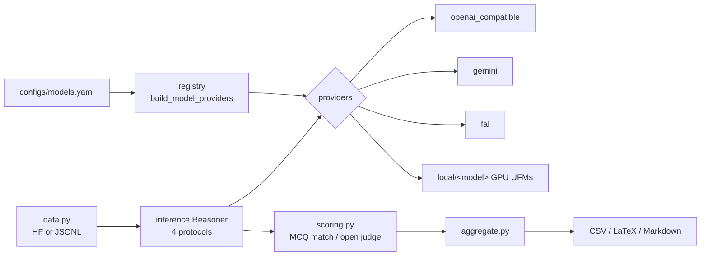

# Contributing

Thanks for improving the UFO evaluation toolkit! This guide explains the
architecture and the two most common contributions: **adding a model** and
**adding a local UFM adapter**.

## Setup

```bash
pip install -e ".[test,dotenv]"
pytest                      # offline unit tests; no GPU/API/network needed
```

## Architecture



```
                         configs/models.yaml
                                 │  (registry.resolve_models / build_model_providers)
                                 ▼
  data.py ──instances──►  inference.Reasoner ──► providers/<backend>
 (HF or JSONL)            (4 protocols: direct/         │
                          textual/visual/joint)         ├── openai_compatible
                                 │                       ├── gemini
                                 │ writes pred_/cue keys ├── fal
                                 ▼                       └── local/<model>  (GPU UFMs)
                          scoring.py ──► aggregate.py ──► CSV / LaTeX / Markdown
                          (MCQ match /     (per task &
                           open judge)      category)
```

Everything is wired through `ufo_bench/cli.py` (the `ufo-eval` command). Each
`scripts/*.py` is a thin wrapper around it.

### Key contracts

- **Provider** (`providers/base.py`): `complete(text, image_paths, ...) -> (text, err)`
  and `generate_image(prompt, image_paths, save_path) -> (path, err)`.
- **Protocols** (`config.py`): `direct / textual / visual / joint`. `visual` and
  `joint` append the generated cue image to the inputs, so `complete` /
  `_understand` **must accept multiple images**.
- **Result keys**: `pred_<protocol>_<tag>`, `score_<protocol>_<tag>`,
  `text_cue_generated_<tag>`, `image_cue_generated_<tag>` (tag = model display name).

## Add an API model (OpenRouter / OpenAI / Gemini / fal)

Just add an entry to `configs/models.yaml`:

```yaml
- {name: My-Model, id: provider/model-id, group: open_source, provider: openai}
```

`provider` is one of `openai | gemini | fal`. Run with `--models My-Model`.
No code needed.

## Add a local UFM adapter (GPU)

1. Copy `ufo_bench/providers/local/_template.py` to `local/<model>.py`.
2. Implement three methods from the model's **official** inference code
   (see `docs/UFM_OFFICIAL_INFERENCE.md` for the existing 10 as reference):
   - `_load(self)` — build the model/processor (use `self.model_path`, `self.extra`).
   - `_understand(self, prompt, pil_images, max_tokens, temperature) -> str`
     (must handle >1 image; use `imutil.concat_images` if the model is single-image).
   - `_generate(self, prompt, pil_images) -> PIL.Image` (the visual cue).
3. Register it in `local/__init__.py`:
   ```python
   LOCAL_ADAPTERS["<model>"] = "<module>:<ClassName>"
   ```
4. Add a `models.yaml` entry with `provider: local`, `local_adapter: <model>`,
   `model_path: ...` (any extra fields are forwarded to the adapter via `self.extra`).
5. Sanity-check construction (no GPU needed):
   ```bash
   python -c "from ufo_bench.providers import build_provider; \
              build_provider('local','x',local_adapter='<model>',model_path='x')"
   ```

## Style & checks

- Keep functions small and documented; avoid narrating comments.
- No hard-coded API keys — read from env only.
- Before a PR: `pytest` passes, `python -m py_compile` clean, and
  `ufo-eval <cmd> -h` works.
