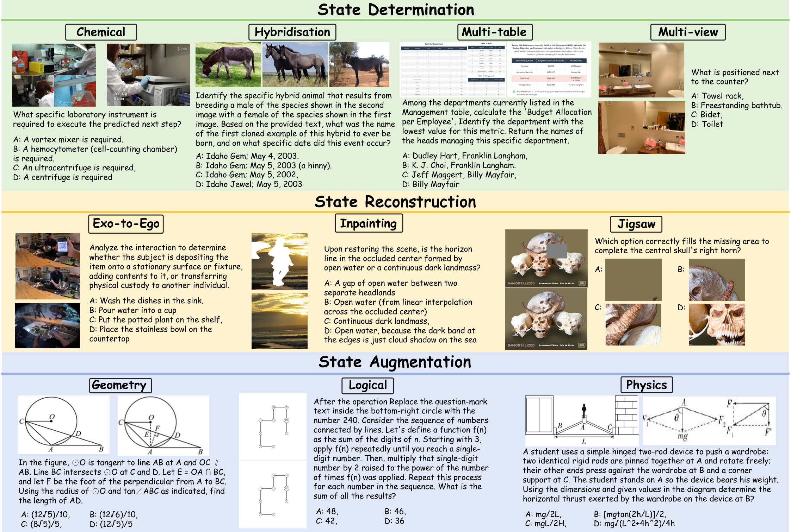
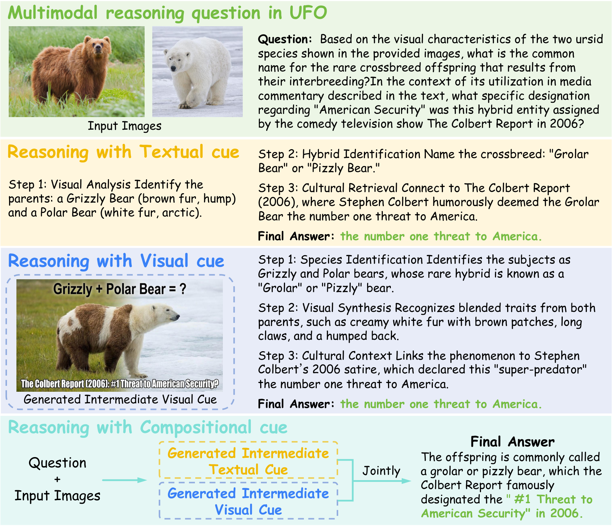

# UFO Benchmark — Evaluation Toolkit

**English** | [中文](README_zh.md)

[](https://huggingface.co/datasets/yzzyu/UFO)
[](https://creativecommons.org/licenses/by-nc/4.0/)
[](https://www.python.org/)

A clean, reproducible pipeline for evaluating multimodal models on the **UFO**
benchmark for compositional multimodal reasoning, aligned with the paper
*"Do Vision and Text Cues Exhibit Evidential Coupling? UFO: A Benchmark for
Compositional Multimodal Reasoning in Unified Models."*

**Dataset:** https://huggingface.co/datasets/yzzyu/UFO

UFO is a **two-step** task: a model first generates intermediate **textual and
visual cues** describing a future state, then answers a question conditioned on
those cues. This toolkit runs that process under four protocols and reports
accuracy aligned with the paper tables.

<p align="center">
  
</p>
<p align="center"><em>UFO spans 3 state-transition regimes × 10 tasks.</em></p>

---

## TL;DR (30 seconds)

```bash
pip install -e .                      # installs the `ufo-eval` command
cp .env.example .env                  # put your OPENROUTER_API_KEY in .env
ufo-eval run --models GPT-5.1 --split mcq --limit 30 --out outputs/demo
```

That one command runs **inference → scoring → tables** and prints an accuracy
summary. Results land in `outputs/demo/` (`tables/results.csv`,
`tables/summary.md`, `tables/main_table.tex`).

> No install? Use `python -m ufo_bench run ...` or `python scripts/run_eval.py ...`.

---

## Pipeline

<p align="center">
  
</p>

Given the input images + question, the model generates an intermediate **textual
cue** and/or **visual cue**, then answers — alone (`direct`) or conditioned on
those cues (`textual` / `visual` / `joint`). The toolkit then scores answers and
builds result tables.

```
            ┌─ generate text cue ─┐
 image(s) ──┤                     ├─► answer (direct/textual/visual/joint) ─► score ─► tables
 question   └─ generate visual cue┘
```

### The 4 protocols

| Protocol | Inputs to the answer step |
| --- | --- |
| `direct`  | input images only (no intermediate cue) |
| `textual` | input images + generated **text** cue |
| `visual`  | input images + generated **visual** cue (image) |
| `joint`   | input images + text cue + visual cue |

Genuine cross-modal synergy shows up as **joint > unimodal**.

### Taxonomy (3 categories × 10 tasks)

- **State Determination**: Hybridisation, Chemical, Multi-table, Multi-view
- **State Reconstruction**: Inpainting, Exo-to-Ego, Jigsaw
- **State Augmentation**: Geometric, Logical, Physics

---

## Install & configure

```bash
pip install -e .                 # core
pip install -e ".[fal,dotenv]"   # optional: fal-hosted models + .env auto-load
```

API keys are read from the environment only (never hard-coded). Put them in
`.env` (auto-loaded if `python-dotenv` is installed) or `export` them:

| Env var | For |
| --- | --- |
| `OPENROUTER_API_KEY` / `OPENAI_API_KEY` | OpenAI-compatible models (GPT, Qwen, Gemma) |
| `GEMINI_API_KEY` / `GOOGLE_API_KEY` | `provider: gemini` |
| `FAL_KEY` | `provider: fal` |
| *(none)* | `provider: local` UFMs run on your GPU |

---

## Usage

### One command (recommended)

```bash
# via a config file (edit configs/run.yaml once, reproducible)
ufo-eval run --run-config configs/run.yaml

# or with flags (flags override the config)
ufo-eval run --models GPT-5.1 Qwen3-VL-8B --split mcq --limit 30 --out outputs/mcq
```

Select models by name, by group, or all:

```bash
ufo-eval run --models all
ufo-eval run --models group:proprietary
ufo-eval run --models group:unified           # the local UFMs
```

Check your setup without calling any API:

```bash
ufo-eval infer --source yzzyu/UFO --split mcq --models GPT-5.1 --dry-run
```

### Step by step (if you prefer)

```bash
ufo-eval infer  --source yzzyu/UFO --split mcq --models GPT-5.1 --limit 30 --out outputs/mcq
ufo-eval score  --pred outputs/mcq/GPT-5.1.json          # --model auto-detected
ufo-eval tables --scored "outputs/mcq/*_scored.json" --out outputs/mcq/tables
```

### What you get

`outputs/.../tables/summary.md` (also printed to the console):

```
| Model       | Direct | Textual | Visual | Joint |
| ---         |   ---: |    ---: |   ---: |  ---: |
| GPT-5.1     |  46.50 |   48.46 |  49.12 | 52.12 |
| Qwen3-VL-8B |  ...   |   ...   |  ...   | ...   |
```

plus `results.csv` (per-task accuracy) and `main_table.tex` (paper-style table).

---

## Dataset

The UFO benchmark lives on the Hugging Face Hub:
**https://huggingface.co/datasets/yzzyu/UFO** — 2 splits (`mcq`, `open`), images
embedded, ~3.4k questions across 10 tasks.

### Get it (pick one)

**1. Nothing to do — auto-download (default).** Any command with
`--source yzzyu/UFO` pulls the data via 🤗 `datasets` and caches images to
`data_cache/`:

```bash
ufo-eval run --source yzzyu/UFO --split mcq --models GPT-5.1 --limit 30 --out outputs/mcq
```

**2. Pre-download** (offline / cluster / faster first run):

```bash
ufo-eval download                       # both splits -> data_cache/
ufo-eval download --splits mcq --out data_cache
```

**3. Raw files via the HF CLI** (browse parquet/jsonl/images yourself):

```bash
pip install -U "huggingface_hub[cli]"
huggingface-cli download yzzyu/UFO --repo-type dataset --local-dir ./UFO_data
```

**4. In Python:**

```python
from datasets import load_dataset
ds = load_dataset("yzzyu/UFO", split="mcq")   # or "open"
ex = ds[0]
ex["input_images"]   # list[PIL.Image]
ex["cue_image"]      # PIL.Image | None (ground-truth visual cue)
ex["question"], ex["choice_a"], ex["answer"]
```

> Gated/private dataset or rate-limited? `huggingface-cli login` once, or set
> `HF_TOKEN` in `.env`. The public `yzzyu/UFO` needs no token.

### Fields (per split)

| Field | Type | Notes |
| --- | --- | --- |
| `id`, `category`, `task`, `question_type` | str | `question_type` ∈ {mcq, open} |
| `input_images` | list[Image] | the current-state image(s) |
| `question` | str | |
| `choice_a`–`choice_d` | str | MCQ options (empty for open) |
| `answer` | str | option letter (mcq) or reference text (open) |
| `text_cue` | str | ground-truth textual cue |
| `cue_image` | Image \| null | ground-truth visual cue |
| `solution` | str | rationale (where available) |

### Use your own local copy

`--source /path/to/ufo_mcq.jsonl` (images resolved relative to the file, or pass
`--image_root`). Useful if you exported the dataset locally.

---

## Models & platforms

Models live in [`configs/models.yaml`](configs/models.yaml). Each is reached
through a `Provider` backend:

| Provider | Models | Key |
| --- | --- | --- |
| `openai` | OpenRouter / OpenAI / DashScope: GPT, Qwen-VL, Gemma | `OPENROUTER_API_KEY` |
| `gemini` | Gemini native (text + inline image gen) | `GEMINI_API_KEY` |
| `fal` | fal.ai hosted models | `FAL_KEY` |
| `local` | **Unified Foundation Models on local GPU** (see below) | — |

### Unified Foundation Models (local GPU)

All 10 paper UFMs have adapters in `ufo_bench/providers/local/`, each written
from the model's **official inference code** (sources + verbatim snippets in
[`docs/UFM_OFFICIAL_INFERENCE.md`](docs/UFM_OFFICIAL_INFERENCE.md)):
`bagel`, `janus_pro`, `emu3`, `omnigen2`, `ovis_u1`, `unipic2`, `unicot`,
`omni_r1`, `unipic1`, `uniworld_v1`.

To run one: clone its official repo, install its deps, download the weights,
`export PYTHONPATH=/path/to/repo`, set `model_path` in `configs/models.yaml`, then
`ufo-eval run --models Bagel ...`. All 10 implement both understanding and visual
cue generation, so every model supports all 4 protocols (validate on your GPU —
these cannot run CPU-only). To add a new one, copy
`ufo_bench/providers/local/_template.py`.

---

## Repository layout

```
ufo_benchmark/
├── configs/
│   ├── models.yaml          # model registry (provider, ids, judge model)
│   └── run.yaml             # config-driven `ufo-eval run`
├── ufo_bench/
│   ├── cli.py               # the `ufo-eval` command (all subcommands)
│   ├── config.py            # taxonomy & protocol definitions (paper-aligned)
│   ├── data.py              # load UFO from local JSONL or HF (yzzyu/UFO)
│   ├── prompts.py           # cue-generation / answering / judging prompts
│   ├── inference.py         # the 4-protocol reasoning engine
│   ├── scoring.py           # MCQ letter match + open-ended LLM judge
│   ├── cue_eval.py          # generated-cue vs GT-cue quality (process eval)
│   ├── aggregate.py         # CSV / LaTeX / Markdown result tables
│   ├── registry.py          # models.yaml loader + provider builder
│   ├── runner.py            # resumable parallel map + JSON IO
│   ├── imutil.py            # image encode / save / merge helpers
│   └── providers/           # platform backends (openai / gemini / fal / local/*)
├── scripts/                 # thin wrappers around the CLI (back-compat)
├── tests/                   # offline unit tests (pytest, no GPU/API)
└── docs/UFM_OFFICIAL_INFERENCE.md   # official inference code per UFM
```

---

## Process evaluation (cue quality)

Measure whether generated cues are state-consistent with the ground-truth cues
(the paper's evidential-coupling check):

```bash
ufo-eval cue-eval --pred outputs/mcq/GPT-5.1.json --targets text visual
```

## Result keys (in the JSON files)

Model tag = the model's display name. Per instance:

- `text_cue_generated_<tag>`, `image_cue_generated_<tag>` — generated cues
- `pred_<protocol>_<tag>` — raw answer
- `score_<protocol>_<tag>` — 0/1 correctness
- `cue_text_score_<tag>`, `cue_visual_score_<tag>` — cue-quality scores

## Tests

```bash
pip install -e ".[test]" && pytest        # offline; no GPU/API/network needed
```

## Notes

- All API calls retry with backoff; runs are **resumable** (re-running skips done items).
- MCQ scoring is offline (option-letter match); only open-ended scoring uses a judge.
- Figures in `assets/` (`teaser.png`, `framework.png`) are from the UFO paper.
